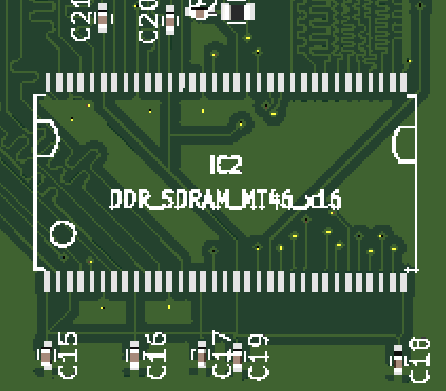
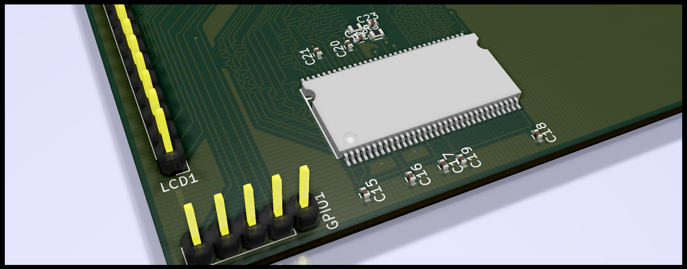

## Freecad model for TSOP 66 
MT46V32M16P-5B:J
The step file is also added as part of this repo.

This is a very rough cad model only created to see if footprint matches with dimensions specific in the spec of MT46V32M16P-5B:J

Tested with Kicad footprint form opendous

After Step integration on PCB.

### Footprint Image

### Step File in KiCAD

### Rendered Image in Kicad
